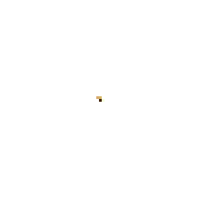
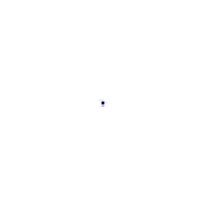
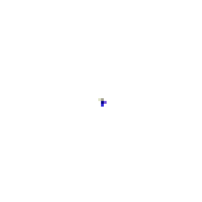
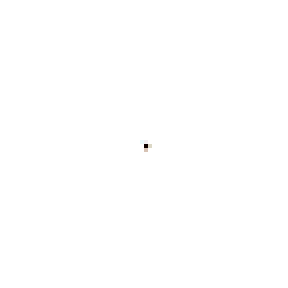
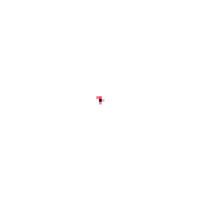
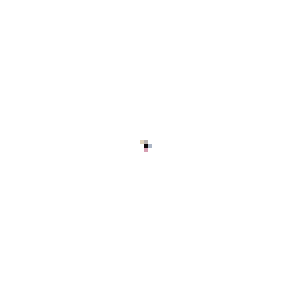

# Self-Healing Pixels

**Cut the lizard in half. Watch it grow back.**

### ▶ [Live demo](https://arpankumarm.github.io/self-healing-pixels/): runs in your browser, no install

<p align="center">
  
  
  
  <br>
  
  
  
</p>

Every pixel in these images runs **the same tiny neural network** (about 8,000 parameters) and can only see its 8 neighbours. There is no central controller, no global view, and not even a shared clock: cells update at random. Even so, starting from **a single pixel**, the cells grow a complete emoji. When you cut it apart, they **regenerate** the missing piece.

This is a *Neural Cellular Automaton*, a reimplementation of [Growing Neural Cellular Automata](https://distill.pub/2020/growing-ca/) (Mordvintsev et al., Distill 2020). The models are trained from scratch in PyTorch on a MacBook's GPU and run live in the browser with TensorFlow.js.

**API cost: $0.** Hosting: free, on GitHub Pages.

---

## Things to try in the demo

| Try | What happens |
|---|---|
| **Drag across the image** | You erase cells. The survivors notice what's missing and rebuild it. |
| **✂️ Cut in half** | Half the organism regrows the other half. |
| **🌱 Regrow from seed** | Watch the whole image develop from a single cell. |
| **Rotate the physics** | The image grows *rotated*, even though the model never saw rotation in training (see below). |
| **Show hidden channels** | See the cells' private "memory": 3 of the 12 hidden values they learned to use for signalling. |

---

## How it works

### One cell's view of the world

Each cell stores **16 numbers**: its colour (RGBA) and 12 hidden values the network is free to use however it likes. At every step, each cell:

1. **Perceives** its 3×3 neighbourhood through three fixed filters: its own state (identity), the horizontal gradient (Sobel-x) and the vertical gradient (Sobel-y). That gives a 48-number perception vector.
2. **Thinks:** a 2-layer network (48 → 128 → 16) turns the perception into an *update* to its own state.
3. **Updates at random:** each cell applies its update with probability 0.5, so there is no global synchronisation.
4. **Lives or dies:** a cell counts as alive only if it or a neighbour has alpha > 0.1. Everything else is reset to empty.

```
            3×3 neighbourhood           perception (48)        update (16)
 ┌───┬───┬───┐   identity ─┐
 │ · │ · │ · │   Sobel-x  ─┼──►  [ 48 ] ──► Dense 128 ──► ReLU ──► Dense 16 ──► state += update
 │ · │ ● │ · │   Sobel-y  ─┘                                                    (random 50% of cells)
 │ · │ · │ · │
 └───┴───┴───┘
```

That's the whole program. Every cell runs exactly this, with the same weights.

### Teaching it to heal

Training asks for a hard property: grow the target from one seed, **stay** stable indefinitely, and **recover** from damage. Three tricks from the paper make this work (see [`train.py`](src/self_healing_pixels/train.py)):

- **Grow for a random time.** Each training step runs the automaton for 64–96 steps and compares the result with the emoji. The random length means the model can't just time its growth for one exact step.
- **Sample pool.** The model keeps a pool of 1,024 of its own past outputs and usually continues from those rather than from a fresh seed. That teaches it to *maintain* the image, not just reach it once and then explode. The worst sample in each batch is swapped for a fresh seed so it never forgets how to grow.
- **Damage during training.** In every batch, the 3 best-looking samples get a random circular hole punched in them. The model has to learn to fill it in.

It never saw a straight cut, a diagonal slash or a rotation. It handles those anyway because the rule it learned is local and general.

### Why rotation works

Cells only know which way is "up" through the Sobel filters. Rotating those two filters by an angle θ turns every cell's sense of direction together, so the organism grows rotated by θ, with no retraining. In the demo, the slider rebuilds the perception kernel live.

---

## Run it yourself

You need [uv](https://docs.astral.sh/uv/). An Apple Silicon Mac (MPS) or an NVIDIA GPU is recommended; a CPU works but is slow.

```bash
git clone https://github.com/ArpanKumarM/self-healing-pixels.git
cd self-healing-pixels
uv sync

# Open the demo locally with the pre-trained models
cd docs && python3 -m http.server 8000     # then visit http://localhost:8000

# Train your own (writes docs/models/<name>.json + checkpoints/<name>.pt)
uv run train lizard --iterations 4000      # ≈ 25 min per emoji on an M3 Pro
uv run train                               # every PNG in emoji/

# Render the grow → cut → heal GIFs used in this README
uv run animate
```

### Train on your own image

1. Drop a square PNG with a transparent background into `emoji/` (e.g. `emoji/rocket.png`). It is resized to 40×40.
2. Run `uv run train rocket`.
3. Add `{ name: "rocket", emoji: "🚀" }` to `MODELS` in [`docs/app.js`](docs/app.js).

Simple shapes with bold colours train best. Thin lines and fine detail are hard for cells that only see their neighbours.

---

## Project layout

```
self-healing-pixels/
├── src/self_healing_pixels/
│   ├── nca.py        # the cellular automaton: perception, update rule, alive masking
│   ├── train.py      # sample-pool + damage training, JSON export for the browser
│   └── animate.py    # renders grow → cut → heal GIFs
├── docs/             # the GitHub Pages site
│   ├── index.html, style.css
│   ├── nca.js        # the same automaton in TensorFlow.js
│   ├── app.js        # rendering loop, mouse damage, controls
│   └── models/       # trained weights (~80 KB each)
├── emoji/            # training targets (Noto Emoji)
├── assets/           # README GIFs
└── tests/            # includes a browser-vs-PyTorch parity test
```

## Tests

```bash
npm install        # TensorFlow.js for Node, only needed for the parity test
uv run pytest
```

The key test, **`test_browser_step_matches_pytorch`**, feeds the same weights and the same random state through the PyTorch model and through the browser's `nca.js` under Node. Their outputs must match to 1e-4, both upright and rotated. This proves the live demo runs exactly the model that was trained.

---

## Results and limitations

Each model trained for 4,000 iterations, about 60 minutes on an M3 Pro (three trained in parallel). Losses are the final training MSE against the target:

| Pattern | Training loss | Grows | Heals a half-cut | Stable for 2,000+ steps |
|---|---:|:-:|:-:|:-:|
| 🦎 Lizard | 0.00015 | ✅ | ✅ | ✅ |
| 🍄 Mushroom | 0.0031 | ✅ | ✅ (spots can regrow slightly differently) | ✅ |
| 🌻 Sunflower | 0.0022 | ✅ | ✅ | ⚠️ slowly loses petals over very long runs |
| 🦋 Butterfly | 0.00037 | ✅ | ✅ | ✅ |
| 🐙 Octopus | 0.0026 | ✅ | ✅ (tentacles can regrow slightly differently) | ✅ |
| 🐠 Fish | 0.0014 | ✅ | ✅ | ⚠️ stripe pattern slowly drifts over very long runs |

The paper trains for 8,000 iterations. More training, especially for the sunflower and fish, should improve long-run stability.

## Credits

- Method: [Growing Neural Cellular Automata](https://distill.pub/2020/growing-ca/), Alexander Mordvintsev, Ettore Randazzo, Eyvind Niklasson, Michael Levin. *Distill*, 2020.
- Emoji: [Noto Emoji](https://github.com/googlefonts/noto-emoji) by Google, Apache License 2.0.
- This is an independent reimplementation, trained from scratch.
